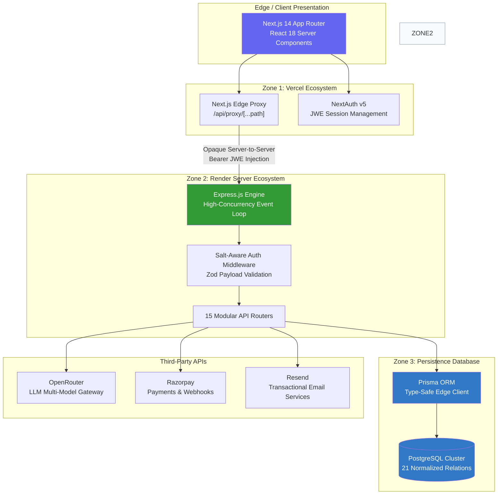
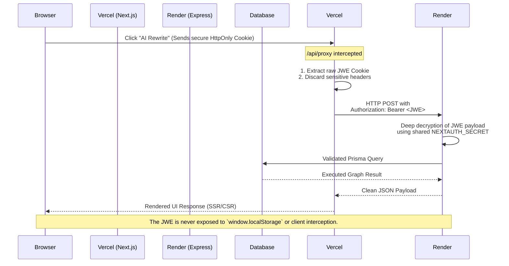

<div align="center">
  

  <h2>Architected for Perfection. Built for Production.</h2>

  <p>
    An enterprise-grade, full-stack AI writing SaaS. Featuring a highly concurrent LLM pipeline, multi-tenant RBAC workspaces, an ACID-compliant virtual economy, and zero-leakage cross-domain authentication.
  </p>

  <p>
    <a href="https://wordsage.vercel.app"></a>
    <a href="https://wordsage-l10x.onrender.com/api/health"></a>
    
    
    
    
  </p>
</div>

<br />

---

WordSage is not merely an application; it is an exercise in **engineering excellence**. It represents the culmination of distributed systems architecture, uncompromising security practices, and a masterfully crafted user experience. Whether you evaluate it through the lens of a user seeking frictionless AI collaboration or a Senior Staff Engineer parsing its infrastructural decisions, WordSage stands as a testament to what modern, decoupled web architecture can achieve.

## 🧭 The Product Vision (User's Perspective)

WordSage fundamentally redefines how individuals and teams interact with Generative AI. It transforms the chaotic nature of prompting into a structured, highly predictable asset creation pipeline.

### The Ultimate AI Workspace
- **For the Visionary Creator:** Access over 30 meticulously crafted document templates spanning SEO, Marketing, Legal, and HR. Highlight any text within the intelligent *Tiptap* editor to seamlessly execute 11 specialized AI functions (Rewrite, Expand, Humanize, Plagiarize Check, and more).
- **For the Enterprise Team:** WordSage introduces the **Multi-Tenant Workspace**. Team owners configure **Brand Voice and Tone Guides** that are deterministically enforced across the organization. Every AI generation performed by a team member is silently injected with these constraints, ensuring unparalleled brand consistency. 
- **The Engine of Value:** Real-time collaborative document editing, threaded inline comments, presence indicators, and document approval workflows ensure that content flows from draft to publication flawlessly.

---

## 💻 The Architecture of Perfection (Engineer's Perspective)

From the very first line of code, WordSage was designed to scale. It rejects the limitations of monolithic serverless architectures by physically decoupling the UI computation layer from the heavy background processing layer.

### 🌟 Key Engineering Triumphs

1. **The Decoupled Paradigm:** The stack utilizes Next.js 14 exclusively for SSR/Edge optimizations and client routing, while an Express.js Node runtime handles the backend. This allows long-lived connections for real-time WebSockets, massive PDF generation streams, and unpredictable LLM timeouts without hitting Vercel’s aggressive serverless execution limits.
2. **Zero Cross-Origin Cookie Leakage:** Resolving the auth bridging dilemma between *Vercel* and *Render* without exposing sensitive tokens to the DOM. WordSage utilizes a custom Next.js server proxy that strips the HTTP-only `__Secure-authjs.session-token`, decrypts the payload, and dynamically constructs an `Authorization: Bearer <JWE>` header for the backend.
3. **Impenetrable Financial ACIDity:** The `SkillsCoins` virtual economy is completely transactional. Every LLM request triggers a `prisma.$transaction`—simultaneously deducting the user's wallet, committing the generation log, and auditing the transaction. Race conditions and double-spending are mathematically impossible.
4. **Defense-In-Depth Security:** The API is fortified using `Helmet.js`, multi-tiered IP rate-limiting behind Nginx/Vercel proxies (`trust proxy 1`), a cryptographic disposable email blocker barring 400+ domains, and Razorpay webhooks secured via highly optimized `HMAC-SHA256` signature verification buffers.

---

## 🏛️ System Topology



---

## 🔐 The Flawless Cross-Domain Authentication Proxy

One of the most profound technical achievements in WordSage is its authentication flow. When deploying a decoupled architecture on separate cloud providers, session management typically breaks due to cross-site cookie blocking. WordSage solves this beautifully:



---

## ⚖️ The Economy: SkillsCoins & Razorpay

WordSage leverages a native digital currency, **SkillsCoins**, governed by a strict transaction ledger. 

- **The Ledger (`coins_transactions`)**: An immutable, append-only table recording every single coin earned (Daily Streaks, Referrals, Purchases) and burned (AI Rewriting, Plagiarism Checks). 
- **Razorpay Integration:** Users can purchase one-time packs or subscribe to Pro/Teams tiers. Webhooks fired from Razorpay are verified on the Express layer by computing the `HMAC-SHA256` signature of the raw request payload buffer against our secret, ensuring absolute financial security.

---

## 🧠 The AI Pipeline & Inference Engine

The AI implementation is lightyears beyond a simple ChatGPT API wrapper. It uses structured execution:

1. **Context Aggregation:** If a user is inside a Team workspace, the engine halts and performs a parallel fetch for the `Team Style Guide`.
2. **Rule Injection:** The system dynamically constructs a highly complex system prompt containing the requested task ("Summarize"), the highlighted editor payload, and the specific JSON Array of forbidden words and tone guidelines mandated by the Team Owner.
3. **Execution & Auditing:** The prompt traverses via OpenRouter, utilizing the lowest-latency model appropriate for the task. The resulting processing times, token counts, and input/output deltas are recorded directly into `ai_usage_analytics` to power the user's dashboard charts.

---

## 📊 Relational Mastery: The 21-Model Schema

The PostgreSQL database is fully normalized to 3NF, guaranteeing referential integrity cascading deletes, and complex graph querying via Prisma.

*A brief overview of the logical groupings:*
*   **Identity & Security:** `users`, `accounts`, `sessions`, `verification_tokens`, `password_reset_tokens`
*   **Economy & Telemetry:** `user_profiles`, `coins_transactions`, `transactions`, `ai_usage_analytics`, `analytics`, `audit_logs`
*   **Content & Editor:** `documents`, `revisions`, `plagiarism_checks`
*   **Billing:** `subscriptions`
*   **Enterprise Collaboration:** `teams`, `team_members`, `team_style_guides`, `team_content_library`, `document_versions`, `document_comments`, `document_presence`, `document_approvals`

---

## 🚀 Experience WordSage

### Local Orchestration (Docker Compose)

WordSage is configured for out-of-the-box microservice orchestration using Docker, fronted by an Nginx reverse proxy.

```bash
# 1. Clone the repository
git clone https://github.com/shiteshkhaw/WordSage.git
cd WordSage

# 2. Populate environment configurations
cp backend/.env.example backend/.env
cp frontend/.env.example frontend/.env
# Hydrate .env files with required cryptographic keys and DB URLs

# 3. Ignite the cluster
docker compose up -d --build

# The application is now proxying via http://localhost:80
```

### Manual Developer Bootstrapping

For those requiring granular control and hot-reloading:

```bash
# Initialize the Backend Engine
cd backend
npm install
npx prisma generate
npx prisma db push      # Ensure your Neon/PostgreSQL instance is available
npm run dev             # tsx executing on port 4000

# Initialize the Frontend Interface (New Terminal)
cd frontend
npm install
npm run dev             # Next.js 14 HMR executing on port 3000
```

---

<p align="center">
  Crafted with relentless attention to detail by <strong>Shitesh</strong>. <br/>
  <a href="https://wordsage.vercel.app">Experience the Application</a>
</p>
