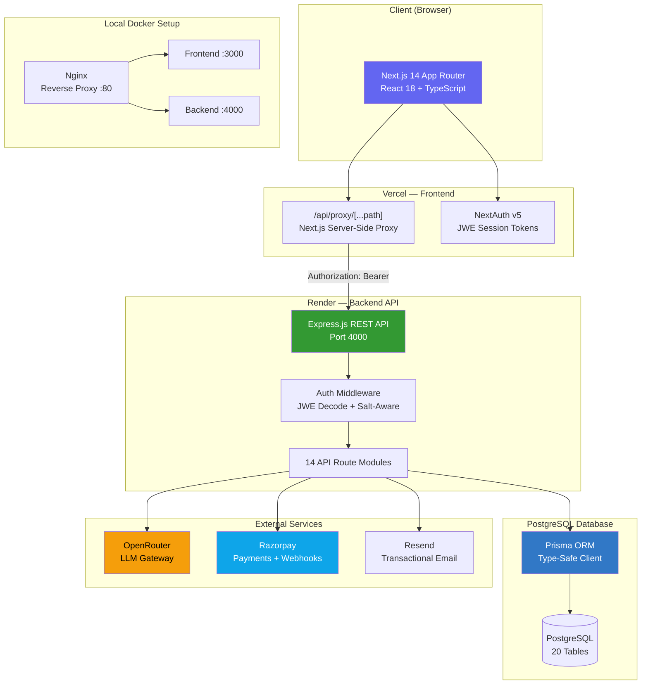
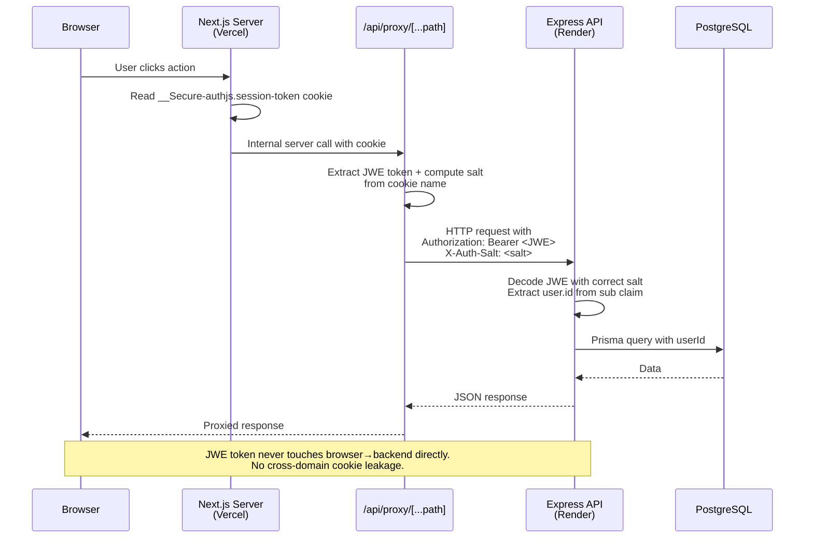
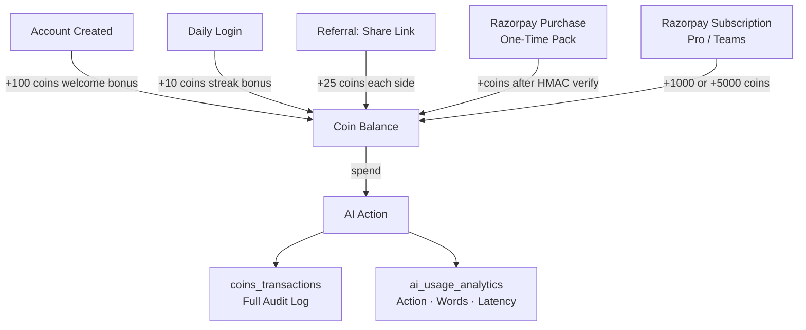
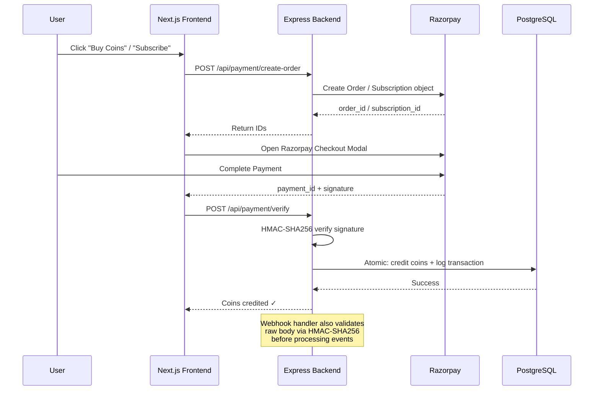
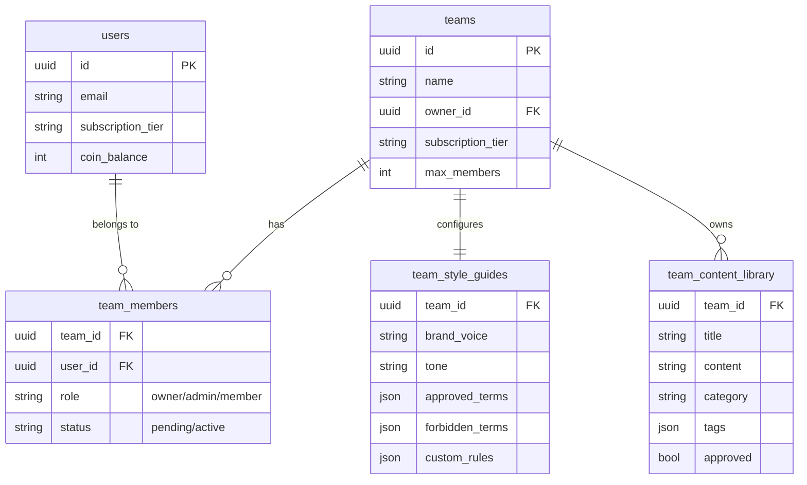
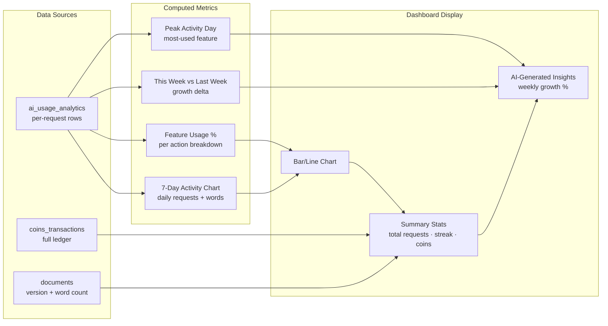
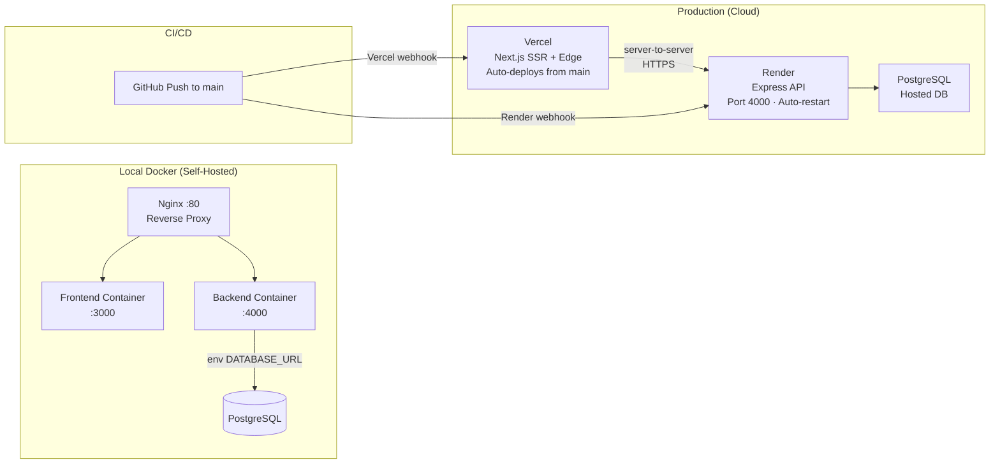

<h1 align="center">
  
</h1>

<p align="center">
  <strong>Production-grade, full-stack AI Writing SaaS Platform</strong><br/>
  Multi-tenant team collaboration · LLM pipeline · Virtual economy · Razorpay payments · Analytics engine
</p>

<p align="center">
  <a href="https://word-sage-tan.vercel.app"></a>
  <a href="https://wordsage-krvw.onrender.com/api/health"></a>
  
  
  
  
  
</p>

---

## 📌 What is WordSage?

WordSage is a **production-deployed, full-stack AI writing SaaS** built from the ground up — featuring an LLM-powered writing engine, a multi-tenant team collaboration workspace with RBAC, a virtual currency economy (SkillsCoins), Razorpay payment integration, 30+ document templates, and a complete analytics dashboard.

The entire system is built with strict TypeScript across frontend and backend, is fully containerised with Docker + Nginx, and is deployed on Vercel (frontend) + Render (backend) with zero cross-origin cookie exposure.

> **One-liner for résumé:**
> *Architected and shipped WordSage — a production-grade AI writing SaaS on Next.js 14 + Express + PostgreSQL, featuring a multi-tenant RBAC team workspace, an LLM pipeline with 11 AI actions, a Razorpay billing system with HMAC-SHA256 webhook verification, and a virtual currency economy with full transaction audit logging.*

---

## 🔗 Quick Links

| Resource | URL |
|---|---|
| 🌐 Live App | [word-sage-tan.vercel.app](https://word-sage-tan.vercel.app) |
| ⚙️ Backend API | [wordsage-krvw.onrender.com/api/health](https://wordsage-krvw.onrender.com/api/health) |
| 💻 GitHub | [github.com/shiteshkhaw/WordSage](https://github.com/shiteshkhaw/WordSage) |

---

## ⚙️ Tech Stack

| Layer | Technologies |
|---|---|
| **Frontend** | Next.js 14 (App Router), React 18, TypeScript, Tailwind CSS |
| **Auth** | NextAuth v5 — Credentials + Google OAuth + GitHub OAuth, JWE session tokens |
| **Backend** | Node.js, Express.js, TypeScript (ESM), Zod validation |
| **Database** | PostgreSQL · Prisma ORM 5.22 · 20 normalized models |
| **AI Engine** | OpenRouter API (LLM gateway) · 6 standard + 5 advanced AI actions |
| **Payments** | Razorpay · one-time coin packs · monthly subscriptions · HMAC-SHA256 webhook |
| **Email** | Resend (transactional invite emails) |
| **Security** | Helmet.js · express-rate-limit · bcryptjs · CORS hardening |
| **DevOps** | Docker · docker-compose · Nginx reverse proxy · SIGTERM graceful shutdown |
| **Deployment** | Vercel (frontend SSR/SSG) + Render (backend API, auto-sleep disabled) |

---

## 🏗️ System Architecture



---

## 🔐 Authentication & Cross-Domain Architecture

One of the most technically challenging problems solved in WordSage is **zero cross-origin cookie exposure** between Vercel (frontend) and Render (backend):



**Key technical decisions:**
- **JWE Salt-Aware Middleware:** NextAuth v5 derives the JWE decryption salt from the cookie name (`__Secure-authjs.session-token` on HTTPS, `authjs.session-token` in dev). The proxy forwards the cookie name as `X-Auth-Salt` so the backend always uses the correct salt.
- **Server-to-Server Only:** The `Authorization: Bearer` header is added exclusively on the Next.js server — never in client-side code. Zero token leakage to the browser.
- **Strict env-var enforcement:** `process.env` is validated at startup. Missing variables cause immediate exit — no silent runtime failures.

---

## 🤖 AI Writing Engine

```mermaid
flowchart LR
    subgraph "User Input"
        TEXT[Selected Text]
        ACTION[AI Action Choice]
        TEAM{In Team<br/>Workspace?}
    end

    subgraph "Style Enforcement"
        STYLE[Team Style Guide\nbrand voice · tone\napproved/forbidden terms]
        VIOLATIONS[Violation Detection\nreturns violations array]
    end

    subgraph "LLM Pipeline"
        PROMPT[Prompt Builder\naction-specific system prompt]
        OPENROUTER[OpenRouter API\nLLM Gateway]
        RESULT[AI Generated Text]
    end

    subgraph "Post-Processing"
        COIN[Deduct SkillsCoins\natomic DB transaction]
        LOG[Write ai_usage_analytics\naction · tokens · latency · coins]
        OUT[Return to User]
    end

    TEXT --> ACTION
    ACTION --> TEAM
    TEAM -->|Yes| STYLE
    STYLE --> VIOLATIONS
    VIOLATIONS --> PROMPT
    TEAM -->|No| PROMPT
    PROMPT --> OPENROUTER
    OPENROUTER --> RESULT
    RESULT --> COIN
    COIN --> LOG
    LOG --> OUT
```



### Standard AI Actions

| Action | Coin Cost | Description |
|---|---|---|
| Fix Grammar | 5 | Corrects grammar, punctuation, and spelling |
| Improve Writing | 10 | Enhances clarity, flow, and word choice |
| Rewrite | 15 | Fully rewrites while preserving original meaning |
| Summarize | 8 | Condenses long-form content to key points |
| Expand | 15 | Elaborates and fleshes out brief drafts |
| Custom Prompt | 20 | Free-form AI instruction on any selected text |

### Advanced AI Features

| Feature | Coin Cost | Description |
|---|---|---|
| Plagiarism Check | 30 | Detects potential plagiarism; stores similarity scores + sources |
| Rewrite Unique | 25 | Generates a verified plagiarism-free unique rewrite |
| Humanize | 20 | Makes AI-generated text sound authentically human |
| Bypass AI Detector | 20 | Restructures text to evade AI detection classifiers |
| Generate Citation | 10 | Creates properly formatted academic citations |

**Team-Aware AI:** Every LLM request inside a team workspace is contextually constrained by the team's style guide — brand voice, tone, approved/forbidden terms — enforced in real-time before generation. Violations are returned inline as a `violations[]` array.

---

## 💰 SkillsCoins Virtual Economy

A fully transactional virtual currency system built from scratch with complete audit trails:



| Event | Coins |
|---|---|
| Account creation (welcome bonus) | +100 |
| Daily login streak | +10/day |
| Referral (both sides) | +25 each |
| Pro subscription upgrade | +1,000 |
| Teams subscription upgrade | +5,000 |
| Custom coin packs via Razorpay | Variable |

Every spend and credit is written to `coins_transactions` with: action type, transaction mode, word count, timestamp, and order/payment IDs — a full, immutable audit trail.

---

## 💳 Payment System (Razorpay)



---

## 👥 Multi-Tenant Team Workspace



**Feature breakdown:**
- **RBAC:** `owner` / `admin` / `member` — only owners/admins can invite, edit style guides, or change member roles
- **Email-Based Invitations:** Owners invite by email; invites stay `PENDING` until accepted in-app or via one-click email link (Resend transactional email)
- **Team Style Guide:** Configurable brand voice, tone, approved/forbidden terms, custom writing rules (sentence length, paragraph format, target audience) — enforced at AI generation time
- **Shared Content Library:** Approved content snippets accessible to all team members
- **Document Collaboration:** Shared editor with `document_presence` (cursor tracking), `document_comments` (threaded), `document_versions` (version history), `document_approvals` (draft → review → approved workflow)

---

## 📊 Analytics Dashboard



---

## 📝 Document Templates Engine

30+ professional templates across **10 categories**, each with structured sections, dynamic variable placeholders, and AI-optimized generation prompts:

| Category | Templates |
|---|---|
| 📧 Email | Professional Email · Cold Outreach · Follow-up |
| 📝 Content | Blog Post · LinkedIn Article · How-To Guide |
| 💼 Business | Meeting Notes · Executive Summary · Project Proposal · Case Study |
| 📢 Marketing | Product Description · Landing Page Copy · PPC Ad Copy · Press Release |
| 📱 Social Media | Social Post · Twitter/X Thread · LinkedIn Post |
| 🎓 Academic | Research Summary · Thesis Statement |
| ⚙️ Technical | API Documentation · README.md · Release Notes |
| ⚖️ Legal | Terms of Service · Privacy Policy (GDPR/CCPA) |
| 👥 HR | Job Description · Performance Review |
| 🏠 Other | Property Listing · Destination Guide |

---

## 📂 Database Schema (Prisma)

20 normalized PostgreSQL models with full relational integrity:

```
users                  — core user record (auth + preferences + coin_balance)
user_profiles          — extended profile (streak · referrals · subscription tier)
accounts               — OAuth provider accounts (NextAuth adapter)
sessions               — NextAuth session store
verification_tokens    — email verification tokens

documents              — user documents (version · word_count · char_count)
revisions              — document revision history (model · tokens · cost_usd)
transactions           — coins spent per document action

ai_usage_analytics     — per-request AI metrics (action · input/output length · latency · coins)
analytics              — general event analytics (event_type · event_data · session_id)
audit_logs             — admin audit trail (action · resource · ip · user_agent)
plagiarism_checks      — plagiarism results (similarity_score · sources JSON)
coins_transactions     — full coin ledger (amount · type · action · timestamp)

subscriptions          — Razorpay subscription records (plan · period · status)

teams                  — team workspaces (owner · tier · max_members)
team_members           — RBAC membership (role: owner/admin/member · status)
team_style_guides      — per-team AI style config (voice · tone · terms · rules)
team_content_library   — approved shared content snippets (tags · approved flag)
document_versions      — team document version history
document_comments      — threaded inline comments (selection JSON · resolved state)
document_presence      — real-time cursor presence (last_seen heartbeat)
document_approvals     — document review workflow (draft → pending → approved)
```

---

## 🔒 Security Architecture

| Layer | Implementation |
|---|---|
| **Transport** | HTTPS everywhere; Vercel + Render enforce TLS |
| **Auth tokens** | JWE-encrypted sessions (NextAuth v5); never stored as plaintext |
| **Cross-origin** | Strict CORS allowlist; validated against `ALLOWED_ORIGINS` env var |
| **Headers** | Helmet.js (CSP, HSTS, X-Frame-Options, X-Content-Type-Options) |
| **Rate limiting** | 100 req/min global; 20 attempts/15 min on `/api/auth/*` |
| **Passwords** | bcryptjs hashing; never logged or returned in responses |
| **Webhooks** | Razorpay raw-body HMAC-SHA256 signature verification before processing |
| **Env vars** | Fail-fast at startup if any required var is missing — zero silent fallbacks |
| **Compression** | Gzip via `compression` middleware; reduces payload size ~70% |

---

## 🚀 Deployment Architecture



### Environment Variables

<details>
<summary><b>Backend (.env)</b></summary>

```env
DATABASE_URL=postgresql://...
JWT_SECRET=
AUTH_SECRET=
OPENROUTER_API_KEY=
RAZORPAY_KEY_ID=
RAZORPAY_KEY_SECRET=
RAZORPAY_WEBHOOK_SECRET=
RESEND_API_KEY=
ALLOWED_ORIGINS=https://word-sage-tan.vercel.app
PORT=4000
NODE_ENV=production
```

</details>

<details>
<summary><b>Frontend (.env)</b></summary>

```env
NEXTAUTH_URL=https://word-sage-tan.vercel.app
AUTH_SECRET=
AUTH_GOOGLE_ID=
AUTH_GOOGLE_SECRET=
AUTH_GITHUB_ID=
AUTH_GITHUB_SECRET=
BACKEND_URL=https://wordsage-krvw.onrender.com
```

</details>

---

## 🏃 Running Locally

### Option A — Docker Compose (Recommended)

```bash
# 1. Clone the repo
git clone https://github.com/shiteshkhaw/WordSage.git
cd WordSage

# 2. Fill in backend and frontend .env files
cp backend/.env.example backend/.env
cp frontend/.env.example frontend/.env
# Edit both files with your credentials

# 3. Start all services (Nginx + Frontend + Backend)
docker compose up -d --build

# App is live at http://localhost
```

### Option B — Manual (Development)

```bash
# Terminal 1 — Backend
cd backend
npm install
npm run dev        # tsx watch on port 4000

# Terminal 2 — Frontend
cd frontend
npm install
npm run dev        # Next.js dev on port 3000
```

### Database Setup

```bash
cd backend
npx prisma migrate deploy   # Apply all migrations
npx prisma generate         # Regenerate Prisma client
npx prisma studio           # Optional: visual DB GUI
```

---

## 📁 Project Structure

```
WordSage-prod-grade/
├── frontend/                    # Next.js 14 App Router
│   └── src/
│       ├── app/
│       │   ├── page.tsx         # Landing page
│       │   ├── dashboard/       # Main user dashboard + analytics
│       │   │   └── teams/       # Team workspace pages
│       │   ├── editor/          # AI Writing editor
│       │   ├── coin-store/      # Razorpay purchase UI
│       │   ├── profile/         # User profile + referrals
│       │   ├── admin/           # Admin dashboard
│       │   └── api/
│       │       └── proxy/       # Server-side backend proxy
│       ├── components/          # Reusable UI components
│       ├── lib/                 # API client + utility helpers
│       └── auth.ts              # NextAuth v5 config
│
├── backend/
│   ├── src/
│   │   ├── index.ts             # Express app entry (SIGTERM, healthcheck)
│   │   ├── api/                 # 14 route modules
│   │   │   ├── ai.ts            # LLM pipeline + style enforcement
│   │   │   ├── teams.ts         # Full RBAC team API
│   │   │   ├── team-editor.ts   # Collaborative editing (presence, versions, comments)
│   │   │   ├── payment.ts       # Razorpay order + verify
│   │   │   ├── razorpay.ts      # Subscription + webhook handler
│   │   │   ├── analytics.ts     # Usage analytics queries
│   │   │   ├── templates.ts     # 30+ document templates
│   │   │   ├── auth.ts          # OAuth provisioning
│   │   │   ├── documents.ts     # Document CRUD
│   │   │   ├── bonuses.ts       # Daily streak + referral engine
│   │   │   ├── profile.ts       # User profile management
│   │   │   └── transactions.ts  # Coin ledger
│   │   ├── middleware/          # Auth + request validation
│   │   ├── config/              # CORS + rate limiting config
│   │   ├── services/            # Business logic services
│   │   └── emails/              # Resend email templates
│   └── prisma/
│       └── schema.prisma        # 20-model PostgreSQL schema
│
├── nginx/
│   └── nginx.conf               # Reverse proxy config
├── docker-compose.yml           # Production container orchestration
└── packages/                    # Shared TypeScript types (monorepo)
```

---

## 📈 Feature Summary

| Feature | Status |
|---|---|
| 🔐 Multi-provider Auth (Credentials + Google + GitHub OAuth) | ✅ Production |
| 🤖 AI Writing Engine (6 standard + 5 advanced actions) | ✅ Production |
| 👥 Multi-tenant Team Workspace with RBAC | ✅ Production |
| 💰 SkillsCoins Virtual Economy + Full Transaction Ledger | ✅ Production |
| 💳 Razorpay Payments (one-time + monthly subscriptions) | ✅ Production |
| 📊 Analytics Dashboard (7-day chart + AI insights) | ✅ Production |
| 📝 30+ Document Templates across 10 categories | ✅ Production |
| 📋 Collaborative Editing (presence, versions, comments, approvals) | ✅ Production |
| 📧 Transactional Email (team invites via Resend) | ✅ Production |
| 📱 Fully Responsive (320px → 1920px) | ✅ Production |
| 🔒 Helmet.js + Rate Limiting + HMAC Webhook Verification | ✅ Production |
| 🐳 Docker + Nginx + docker-compose (self-hosted ready) | ✅ Production |
| 🚀 Vercel (frontend) + Render (backend) CD pipeline | ✅ Production |

---

## 🏆 Resume-Ready Bullet Points

```
• Architected and deployed WordSage, a production-grade SaaS AI writing platform on
  Next.js 14 (App Router) + Express.js + PostgreSQL, serving full authentication,
  payments, and real-time team collaboration.

• Engineered a cross-domain proxy layer in Next.js to solve browser cross-origin cookie
  restrictions — forwarding NextAuth JWE session tokens as Bearer headers with correct
  JWE salt, eliminating 500-class auth regressions across Vercel → Render deployments.

• Built a 6-action + 5-advanced-feature LLM pipeline (OpenRouter) with per-action
  SkillsCoin cost enforcement, full transaction audit logging, ai_usage_analytics
  instrumentation, and team-aware style-guide enforcement injected pre-generation.

• Designed and implemented a Razorpay payment system supporting one-time coin purchases
  and monthly recurring subscriptions, with HMAC-SHA256 webhook signature verification
  and atomic PostgreSQL writes via Prisma.

• Built a multi-tenant team collaboration workspace with RBAC (owner/admin/member),
  Resend email invitations, shared content library, configurable style guides, and
  real-time style violation detection injected into the AI generation pipeline.

• Created a 30+ professional template engine across 10 content categories, each with
  structured sections, dynamic variable placeholders, and AI-optimized prompts.

• Designed a 20-model PostgreSQL schema with Prisma ORM covering users, teams, RBAC,
  documents, versioning, collaborative presence, coin economy, and analytics.

• Hardened the backend with Helmet.js CSP headers, global rate limiting (100 req/min),
  strict auth rate limiting (20/15 min), Gzip compression, and SIGTERM graceful
  shutdown — production-ready for zero-downtime deploys.

• Containerised the full stack with Docker Compose + Nginx reverse proxy;
  deployed to Vercel + Render with GitHub-triggered CI/CD pipelines.
```

---

<p align="center">
  Built with ❤️ and shipped to production · <a href="https://word-sage-tan.vercel.app">word-sage-tan.vercel.app</a>
</p>
