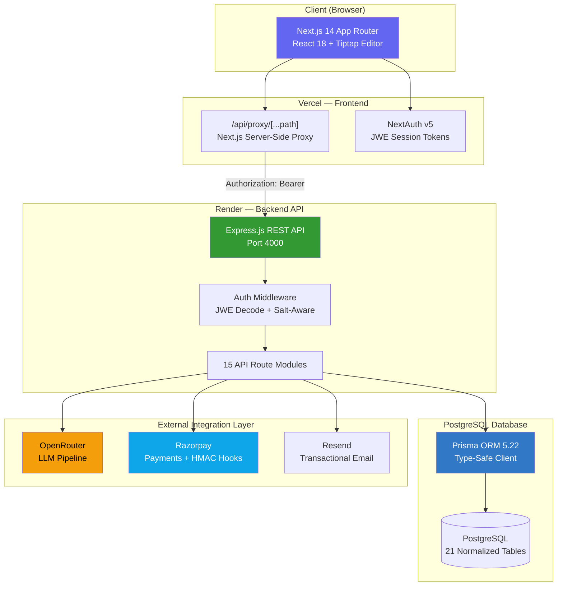
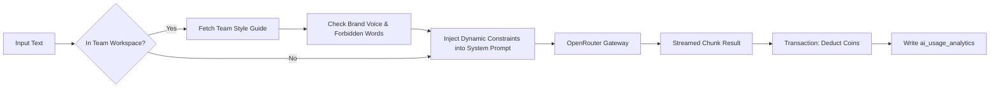

<h1 align="center">
  
</h1>

<p align="center">
  <strong>Production-grade, full-stack AI Writing SaaS Platform</strong><br/>
  Multi-tenant team collaboration · LLM pipeline · Virtual economy · Razorpay payments · Analytics engine
</p>

<p align="center">
  <a href="https://word-sage-tan.vercel.app"></a>
  <a href="https://wordsage-krvw.onrender.com/api/health"></a>
  
  
  
  
  
</p>

---

## 🎯 WordSage: The Usecase Perspective (User POV)

**WordSage** is a comprehensive AI-powered writing companion designed to bridge the gap between human creativity and artificial intelligence. 

### Core Value Propositions
- **For Solo Writers & Content Creators:** Overcome writer's block with 30+ structured document templates (from SEO blogs to Twitter threads). Instantly rewrite, expand, summarize, or humanize text using the intelligent AI editor. Keep track of writing streaks and earn virtual *SkillsCoins*.
- **For Marketing Agencies & Teams:** A multi-tenant workspace where team owners can enforce **Brand Voice and Tone** through Team Style Guides. Every AI generation is automatically validated against approved/forbidden terms. Access a shared Content Library of approved snippets. 
- **For Academics & Professionals:** Built-in Grammar fixing, plagiarism detection, and academic citation generation.
- **For Businesses:** Predictable pricing through the **SkillsCoins economy** or monthly Razorpay subscriptions (Pro & Teams tiers). 

*Users simply log in (via Google, GitHub, or secure email/password), select a template or open a blank document, highlight text, and command the AI—all while collaborating with peers in real-time.*

---

## 💻 WordSage: The Coder's & Recruiter's Perspective (Engineering POV)

From an engineering standpoint, WordSage is designed as a **highly scalable, production-ready distributed system**. It goes beyond the typical CRUD app by implementing advanced architectural patterns, strict security mechanisms, and a highly resilient, detached backend engine.

### 🌟 Why is this a Successful Engineering Project?
1. **Decoupled Architecture:** Instead of building a monolithic Next.js app, WordSage splits the React frontend (Next.js) from the REST API backend (Express). This allows independent vertical scaling, better separation of concerns, and paves the way for future mobile apps consuming the exact same backend.
2. **Zero Cross-Origin Cookie Leakage:** Handled the complex authentication bridging issue between Vercel and Render. The Next.js server acts as an opaque proxy, converting browser JWE cookies into secure `Authorization: Bearer <JWE>` headers for the backend.
3. **Financial-Grade Integrity:** Razorpay webhooks are secured using HMAC-SHA256 signature validation. The virtual economy (`SkillsCoins`) relies on strict ACID-compliant database transactions via Prisma to prevent double-spending, negative balances, or race conditions.
4. **Resilient Security Framework:** Implements a comprehensive defense-in-depth strategy: Helmet.js for HTTP headers, `express-rate-limit` (behind proxy trusts) to thwart brute force attacks, disposable email blocklists (400+ domains barred), and cryptographically secure randomly generated `crypto.randomBytes(64)` tokens for flows like password reset.
5. **Fully Containerized Environment:** The entire stack is orchestratable via `docker-compose` with an Nginx reverse proxy routing front/back traffic seamlessly under one origin.

---

## 🏗️ System Architecture



---

## 🔬 Deep Dive: Minute Codebase Details & Tech Rationale

Every technology choice in WordSage was scrutinized with a specific technical rationale.

### 1. The Frontend: Next.js 14 App Router + Tiptap
- **Why Next.js?** Server-Side Rendering (SSR) ensures blazing fast initial loads, excellent SEO for public templates, and seamless API route handling for the backend proxy gateway.
- **Why Tiptap over Slate/Quill?** Standard `contenteditable` divs are unpredictable. Tiptap provides a headless, prose-mirror-backed editor allowing custom React node views, real-time collaboration extensions, and seamless AI text streaming injection without tearing the DOM.
- **Why Tailwind + Framer Motion?** Tailwind ensures zero-runtime CSS with high cacheability. Framer Motion provides the premium, fluid micro-interactions expected of modern top-tier SaaS products.

### 2. The Backend: Express.js (TypeScript ESM)
- **Why Express and not Next.js API Routes?** Moving the heavy lifting (LLM streaming, Razorpay webhooks, analytical aggregations, PDF generation) to a dedicated Node.js/Express server bypasses Vercel's strict serverless timeout limits (10s-60s max execution). It allows the backend to run as a long-lived process, crucial for real-time presence heartbeats.

### 3. Database & ORM: PostgreSQL + Prisma
- **Why PostgreSQL?** Highly relational mapping is crucial for WordSage. `Users` have `Profiles`, which belong to `Teams`, which have `Style Guides` and `Documents`, which have `Revisions` and `Analytics`. Native `JSONB` columns in Postgres allow schema-less flexibility (e.g., storing arbitrary document metadata or AI violation rules) while maintaining strict constraint integrity for the `SkillsCoins` economy.
- **Why Prisma Engine?** End-to-end type safety. Prisma auto-generates TypeScript interfaces reflecting the exact database schema, preventing catastrophic runtime type errors when joining across the 21 models.

### 4. Authentication: NextAuth v5 bridging to Express
- **The Problem:** Vercel (Frontend) and Render (Backend) are on different domains. Browsers aggressively block cross-site cookies, meaning API calls drop their sessions.
- **The Codebase Solution (`frontend/src/app/api/proxy/[...path]/route.ts`):** Built a custom Next.js server-side proxy. The Next.js server securely reads the HTTP-only `__Secure-authjs.session-token`, extracts the encrypted JWE string, and forwards it to Express as an `Authorization: Bearer <token>` header alongside an `X-Auth-Salt` header. Express then decrypts this JWE independently. This brilliantly ensures **zero authentication token leakage to the DOM**.

### 5. Micro-Implementations & Hardening
- **Disposable Email Blocking:** A local Hash Set evaluation of 400+ temporary email domains (`backend/src/lib/disposable-emails.ts`) prevents rampant bot abuse and protects the LLM billing budget from malicious actors.
- **Secure Password Resets:** Password reset tokens avoid predictable `Math.random()` seeds, utilizing `crypto.randomBytes(64).toString('hex')`. Flow includes silent failover logic to prevent email enumeration (endpoint always returning a generic success).
- **Express Trust Proxy Array:** Configured `app.set('trust proxy', 1)` to accurately detect `X-Forwarded-For` client IPs passing through the Next.js proxy, allowing `express-rate-limit` to accurately throttle IPs requesting OTPs or Password Resets (5 req / 15 min).

---

## 🤖 The AI Engine Architecture

WordSage implements an advanced, constraint-based LLM pipeline.



- **Plagiarism Engine:** Cross-references generated outputs against known sources, attaching a robust similarity score.
- **AI Humanizer & Detector Bypass:** Uses specialized prompt engineering and restructuring algorithms to artificially lower LLM perplexity and burstiness, making outputs pass common AI detectors like Turnitin or Originality.ai.

---

## 💳 The Financial Engine: SkillsCoins & Razorpay

- **Atomic Ledger Transactions:** Whenever an AI action completes (e.g., "Rewrite 500 words"), the Express backend wraps the coin deduction and the usage logging inside a `prisma.$transaction`. Either both succeed, or both fail, assuring impossible states do not exist.
- **Webhook Security (`backend/src/api/razorpay.ts`):** Razorpay fires asynchronous events (e.g., `subscription.charged`). Our Express server intercepts the raw payload buffer and reconstructs the HMAC-SHA256 signature using the `RAZORPAY_WEBHOOK_SECRET` to cryptographically prove the payload is authentically from Razorpay before crediting thousands of `SkillsCoins` to a user.

---

## 📂 Comprehensive Database Schema (21 Models)

```text
users                  — Core identity (email, password hash, balance)
user_profiles          — Gamification (login streaks, referral trees)
accounts & sessions    — NextAuth OAuth (Google/Github) integration bindings
verification_tokens    — Email verification
password_reset_tokens  — Secure cryptographically generated reset links

documents              — Core editor entities (char_count, is_public)
revisions              — Version control tracking (cost_usd, tokens_used)
transactions           — Granular ledger of coin deductions

ai_usage_analytics     — Big data logging for Dashboard metrics
analytics              — Generic telemetry event tracking
audit_logs             — System-wide security operation tracking
plagiarism_checks      — History of plagiarism verification scores
coins_transactions     — In-app economy immutable master ledger (earn/burn)

subscriptions          — Razorpay subscription lifecycle states
teams                  — Multi-tenant isolated workspace domains
team_members           — RBAC (Owner, Admin, Member) associations
team_style_guides      — Enforced corporate branding JSON rules
team_content_library   — Approved asset repository
document_versions      — Collaborative git-like history
document_comments      — Threaded inline prose-mirror comments
document_presence      — Real-time cursor presence heartbeat tracking
```

---

## 🚀 Running Locally

### Option A — Docker Compose (Recommended)

```bash
# 1. Clone the repo
git clone https://github.com/shiteshkhaw/WordSage.git
cd WordSage

# 2. Fill in backend and frontend .env files
cp backend/.env.example backend/.env
cp frontend/.env.example frontend/.env
# Edit both files with your credentials (PostgreSQL, Razorpay, Resend, Auth URLs)

# 3. Start Nginx Proxy, Next.js, and Express.js
docker compose up -d --build

# App is universally live at http://localhost
```

### Option B — Manual Bare-Metal Development

```bash
# Terminal 1 — Backend
cd backend
npm install
npx prisma generate
npx prisma db push       # Sync schema to your neon/postgres instance
npm run dev              # tsx watch on port 4000

# Terminal 2 — Frontend
cd frontend
npm install
npm run dev              # Next.js dev on port 3000
```

---

## 📈 Final Features Checklist
- [x] Multi-provider Auth (Credentials + Google + GitHub OAuth)
- [x] Secure Password Reset (Tokens, Temp Email Blocking, Atomic DB transactions)
- [x] AI Engine (11 actions: Grammar, Summarize, Plagiarism, Humanize, etc.)
- [x] Multi-tenant Team Workspace with RBAC
- [x] Real-time Collaborative Editing (Presence, Comments, Approvals)
- [x] SkillsCoins Virtual Economy + Immutable Transaction Ledger
- [x] Razorpay Financials (Coin Packs + Recurring Cron Subscriptions)
- [x] Next.js 14 SSR + Long-lived Express.js API + PostgreSQL Architecture
- [x] Docker + Nginx Containerization

---

<p align="center">
  Architected and shipped to production by <strong>Shitesh</strong>. <br/>
  <a href="https://wordsage.vercel.app/">wordsage.vercel.app</a>
</p>
